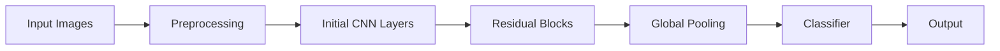
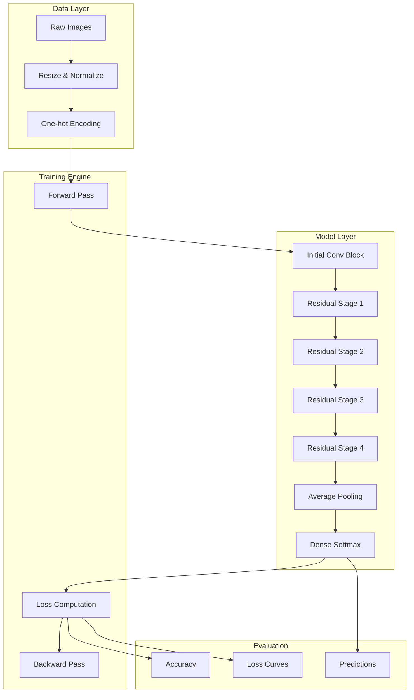

# ResNet-50 from Scratch with TensorFlow/Keras

A deep learning project that implements the ResNet-50 architecture from first principles using TensorFlow 2.x and Keras. The implementation focuses on residual learning by explicitly constructing identity and convolutional blocks, assembling the full network, and training it on a custom multi-class image dataset.

---

## Overview

This repository demonstrates how deep residual networks overcome vanishing gradient problems by introducing skip connections. The project is structured as a modular pipeline, enabling clear understanding, reproducibility, and experimentation with deep CNN architectures.

---

## Features

- Full ResNet-50 implementation from scratch  
- Identity and convolutional residual blocks with skip connections  
- Deep CNN built using Keras Functional API  
- End-to-end pipeline: preprocessing, training, evaluation, inference  
- Model visualization using `plot_model()`  
- Support for custom multi-class datasets  

---

## Dataset

### Custom Image Dataset (6 Classes)

**Description**  
A labeled RGB dataset for supervised multi-class image classification.

**Input Shape**  
64 × 64 × 3  

**Output Labels**  
Six classes encoded using one-hot vectors  

**Usage**  
- Images normalized to [0, 1]  
- Labels converted to categorical format  

---

## System Architecture

### High-Level Pipeline

## Modular System Design

## Model Architecture

- **Input Layer**: (64, 64, 3)

### Initial Block
- Zero Padding  
- 7×7 Convolution  
- Batch Normalization  
- ReLU Activation  
- Max Pooling  

### Residual Stages
- Stage 1: 1 convolutional block + 2 identity blocks  
- Stage 2: 1 convolutional block + 3 identity blocks  
- Stage 3: 1 convolutional block + 5 identity blocks  
- Stage 4: 1 convolutional block + 2 identity blocks  

### Final Layers
- Average Pooling  
- Fully Connected Dense Layer (Softmax)  

- **Framework**: TensorFlow 2.x with Keras  
- **Loss Function**: Categorical Crossentropy  
- **Task**: Multi-class Classification  

---

## Dataset Preprocessing

- Images resized to 64 × 64  
- Pixel values normalized to [0, 1]  
- Labels converted to one-hot encoded vectors  
- Data cast to `float32`  

---

## Training Pipeline

1. Load and preprocess dataset  
2. Build ResNet-50 architecture  
3. Compile model using Adam optimizer  
4. Train model (epochs = 10, batch size = 32)  
5. Track training accuracy and loss  
6. Evaluate on validation/test set  

---

## Evaluation Strategy

- Model evaluated using `model.evaluate()`  
- Loss and accuracy reported after training  
- Supports loading `.h5` saved models  
- Architecture validated using shape summaries  

---

## Inference on Custom Images

1. Place image in `images/` directory  
2. Resize image to 64 × 64  
3. Normalize pixel values  
4. Run model prediction  
5. Output predicted class and probabilities  

---

## Results and Outputs

- Training and validation accuracy  
- Categorical cross-entropy loss  
- Model summary  
- Architecture visualization  
- Predictions on custom images  
